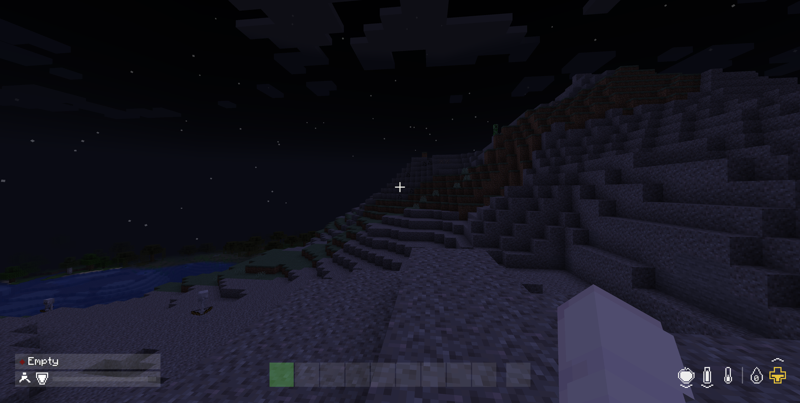
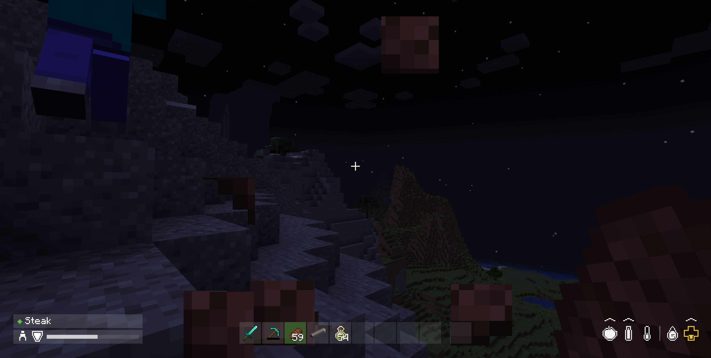
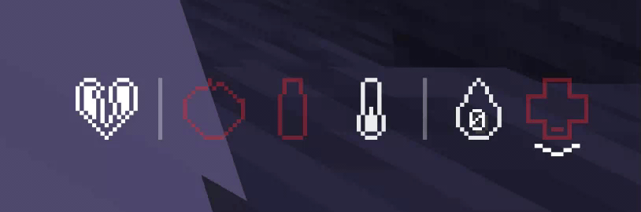
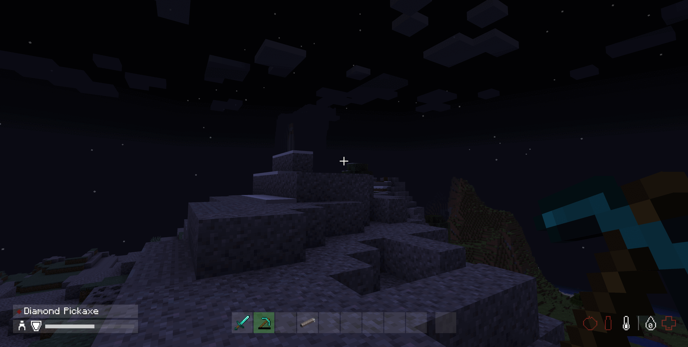
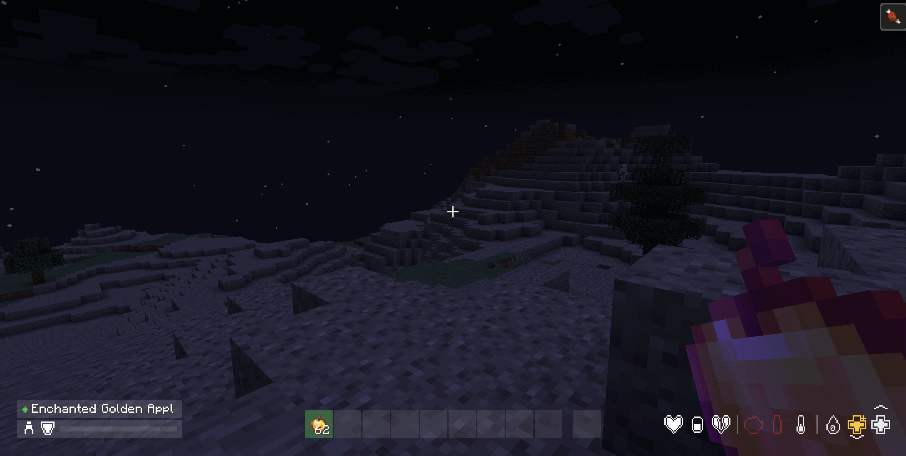

# DayZ Hotbar

[中文](README.md) | **English**

[](LICENSE)
[](https://modrinth.com/mod/dayz-hotbar)
[](https://www.curseforge.com/minecraft/mc-mods/dayz-hotbar)


[](https://github.com/aacanadaa/DayZ-Hotbar/issues)
[](https://ko-fi.com/suoim)

Replaces the Minecraft HUD with a DayZ-style hotbar and a DayZ-style status readout,
styled to match [DayZ Inventory](https://github.com/aacanadaa/DayZ-Inventory).

**Available for Minecraft 1.20.1 through 26.3, from one source tree and three loaders. No
loader needs an API mod.**

The whole version matrix is built from a single source tree with
[Stonecutter](https://stonecutter.kikugie.dev/) conditional compilation, producing one jar
per (loader × game version) pair.

| Minecraft | Fabric | Forge | NeoForge | Java |
| :--- | :---: | :---: | :---: | :---: |
| **1.20.1 – 1.20.4** | ✅ | — | — | 17 |
| **1.20.5** | ✅ | — | — | 21 |
| **1.20.6 – 1.21.1** | ✅ | ✅ | ✅ | 21 |
| **1.21.2** | ✅ | — | ✅ | 21 |
| **1.21.3 – 1.21.5** | ✅ | ✅ | ✅ | 21 |
| **1.21.6 – 1.21.7** | ✅ | — | ✅ | 21 |
| **1.21.8 – 1.21.11** | ✅ | ✅ | ✅ | 21 |
| **26.1 – 26.3** | ✅ | — | ✅ | 25 |

Forge has no 1.21, 1.21.6 or 1.21.7: those Forge lines ship no HUD layer API to hook. Forge
also has no 1.21.2 (never published) and no 26.x. The full reasoning is recorded in
[docs/BUILDING.en.md](docs/BUILDING.en.md).

Every build draws the same HUD, but the jars are **not** interchangeable — take the one
matching your game version and loader.

> **Tip — GUI Scale.** The HUD is laid out at a fixed pixel size and is tuned for
> Minecraft's default *Auto* GUI scale. At a **large** GUI scale the hotbar, the player
> panel and the status readout are pushed together and can meet in the middle of the
> screen; at a very **small** one the icons become hard to read. If either happens,
> adjust **Options → Video Settings → GUI Scale**.




With inventory mod ^^

---

## Features

### The hotbar

Nine slots plus the offhand on a single flat row, in the same near-black translucent
style as the DayZ Inventory screen. Each grey box is 22x22 with a single pixel of
clearance between boxes, and there is no backing plate and no outlines anywhere — slot
state is carried by the colour of the wash alone.

| State | Meaning |
| :--- | :--- |
| Dim wash | Empty |
| Lifted wash | Holds an item |
| Green wash | The slot currently in hand |
| Red wash | In hand, but the item is on cooldown and cannot be used |

Switching slots animates: the newly held slot starts **yellow** and resolves to **green**
over about a third of a second, so a swap reads as an event rather than an instant flip.



### The status readout

A horizontal row of icons in the bottom right, sitting on the same margin as the hotbar
so the whole HUD reads as one line across the screen. Each icon is drawn as a **vessel** —
an outline, a one-cell clear gap, and an interior that fills from the bottom as the value
rises. The outline takes the same colour as the fill, so a yellow icon has a yellow
outline.

The row is divided into three sections, left to right:

| Section | Icons |
| :--- | :--- |
| **Effects** | One mark per family of active potion effect |
| **Sustenance** | Apple for food, with saturation drawn over it as a brighter wash; bottle for water; thermometer for temperature; bubble for air, only while you are underwater |
| **Vitals** | Drop for experience with the level number inside it; gold cross for absorption; cross for health, or your mount's health while riding |

An upright line separates the sections, and only where both sides have something in them
— so the effects divider comes and goes with the effects themselves, while the one
between sustenance and vitals is always there.

Absorption is drawn as a **second cross**, badged with a small plus in its top right,
rather than as an icon of its own — the plus is what tells the two apart.

Icons that come and go do not shift the ones that are always there: the row is
right-aligned, so it grows and shrinks from the left.

> **Water and temperature are drawn but not yet read.** Water mirrors food, so it moves
> when food moves. Temperature sits at half and white, which is "comfortable" on a
> thermometer. Both are placeholders for a thirst and temperature system, and will become
> real readings when such a mod is present.

### Colour bands

Health and food use **DayZ's own bands**, which differ from each other. Health is quoted
against 100 HP; food against a 5,000-point reserve.

| | White | Yellow | Red | Flashing |
| :--- | :--- | :--- | :--- | :--- |
| **Health** | 61–100% | 31–60% | 15–30% | 0–14% |
| **Food** | 16–100% | 6–15% | 2–5% | 0–1.9% |

Minecraft's bars are 20 points for both, so health turns yellow at 12 or less, red at 6 or
less, and flashes under 3 — while food turns yellow at 3 or less, red at 1, and flashes
only when empty. Food is deliberately the more forgiving of the two: in DayZ you are
warned about hunger far later than about blood loss.



The critical band in motion — food, water and health all flashing red at empty. The
beneficial-effect heart on the left and the experience drop stay white through it, because
an effect is either on or off and how far through a level you are is not a warning.

Air has no bands of its own and borrows health's, since drowning and bleeding out are the
same kind of emergency. Absorption and experience are deliberately **not** colour-tiered:
having less absorption is not a warning, and neither is how far through a level you are.

### Trend markers

A stacked chevron shows which way each stat is moving — **above** the icon when it is
rising, **below** it when falling, so the marker is on the side the value is heading.

- **One chevron** — ordinary drift
- **Two chevrons** — a significant change, which is what makes a poison tick or a
  regeneration effect read differently from hunger ticking down on its own

It is held for a second and a half after the movement stops, then fades out — long enough
that a short exchange of damage does not come and go before you see it. Thresholds are per
stat and measured over one second, and are deliberately low for stats that move slowly:
natural health regeneration is only about 0.25 HP per second, so a threshold of 1.0 would
never fire and you would never see that you were healing.

Temperature never shows a marker. Its arrow would point at a direction you cannot act on,
and the reading it will eventually carry is a level rather than a trend.

### The player panel

The bottom left corner carries a two-row panel on the same wash as the hotbar's slots.

- **Upper row** — the held item: a DayZ condition dot (pristine, worn, damaged, badly
  damaged, ruined) and its name. The right half is left deliberately empty for a weapon's
  firing mode, range and ammo.
- **Lower row** — a stance figure (walking, sprinting or crouching), a shield mark, and an
  armour bar.



### Effect marks

Active potion effects are collapsed to **one mark per family** rather than one per effect,
because Minecraft has thirty-odd effects and a row that grew per effect would eat the
screen edge. What matters at a glance is which *kinds* of thing are on you.

| Mark | Family |
| :--- | :--- |
| Heart | Beneficial — speed, strength, night vision |
| Pill | Restorative — regeneration, absorption, saturation |
| Broken heart | Harmful — poison, hunger, mining fatigue, everything else bad |

They are drawn white with no fill level and no colour banding, because an effect is either
on or off. When one ends its mark **fades out** over a second rather than vanishing.



### Hand-drawn, not textured

Every icon is pixel art defined in the source on a 15x15 grid rather than loaded from a
texture. The mod ships no icon art of its own, so it cannot clash with a resource pack.

---

## Installation

Pick the jar for your Minecraft version and loader. The filename carries both, e.g.
`dayz-hotbar-fabric-1.21.1-1.2.0.jar`. Every build draws the same HUD, but they are built
for different versions and loaders and are **not** interchangeable.

1. Install the loader for your game version — [Fabric Loader](https://fabricmc.net/use/),
   [Forge](https://files.minecraftforge.net/net/minecraftforge/forge/) or
   [NeoForge](https://neoforged.net/).
2. Drop the matching jar into your `mods` folder.

Downloads are on the [releases page](https://github.com/aacanadaa/DayZ-Hotbar/releases),
and on both stores under the version you run.

No loader needs an API mod — no Fabric API, and nothing extra on the Forge or NeoForge
side. Forge and NeoForge are separate downloads even though they look similar: they are
different loaders with different HUD APIs, and the jars are not interchangeable.

---

## Dependencies

| | Requirement |
| :--- | :--- |
| Mod version | 1.2.0 (one source tree covers 1.20.1 – 26.3) |
| Fabric | A Fabric Loader matching your game version |
| Forge | A Forge line that ships the HUD layer API, matching your game version |
| NeoForge | 1.20.6 or newer |
| Java | 21+ on 1.20.5+; 17 on 1.20.1–1.20.4; 25 on 26.x |
| Fabric API | Not required |
| Forge / NeoForge API mods | Not required |

---

## Notes

- The vanilla health, hunger, armour, air and experience elements are suppressed rather
  than drawn over, so nothing double-draws.
- Vanilla's own visibility rules are inherited: the HUD still hides behind an open screen,
  in spectator mode, and when you press F1.
- The vanilla attack-strength indicator lived inside the hotbar, so replacing the hotbar
  removes it. It is not reimplemented — set **Options → Video Settings → Attack Indicator**
  to *Crosshair* if you want it back.
- **On Forge 1.20.6 and 1.21.1–1.21.5**, two small vanilla elements go with it: the brief
  "selected item name" popup, and the jump-charge bar while riding a horse. Those Forge
  lines keep the slot row, the experience bar, the health row and the mount's health in a
  single layer, so there is nothing finer to leave switched on. Forge split that block more
  finely from 1.21.8 on, and Fabric and NeoForge keep both throughout.

---

## Building from Source

This tree manages the whole matrix with
[Stonecutter](https://stonecutter.kikugie.dev/): **one source tree**, one version list in
`settings.gradle.kts`, and one build node per (loader × game version) pair. It requires
**JDK 25** as the launcher JDK — the Java 17 / 21 / 25 toolchains each game version needs
are downloaded on demand by the foojay resolver.

```bash
# Build every version and loader in the matrix
JAVA_HOME=/path/to/jdk-25 ./gradlew chiseledBuild

# Build a single node
JAVA_HOME=/path/to/jdk-25 ./gradlew :fabric:1.21.1:build
JAVA_HOME=/path/to/jdk-25 ./gradlew :neoforge:26.2:build
JAVA_HOME=/path/to/jdk-25 ./gradlew :forge:1.21.11:build

# List every node
./gradlew matrix
```

Outputs live under the node's own build directory, with the game version in the filename:

- `fabric/versions/<mc>/build/libs/dayz-hotbar-fabric-<mc>-<version>.jar`
- `neoforge/versions/<mc>/build/libs/dayz-hotbar-neoforge-<mc>-<version>.jar`
- `forge/versions/<mc>/build/libs/dayz-hotbar-forge-<mc>-<version>.jar`

Each of those is the shippable artifact — none needs a post-processing step. A
`-sources.jar` is written to the same folder, so take care to pick the right file if you
are copying by hand. See [docs/BUILDING.en.md](docs/BUILDING.en.md) for how the build is
put together and why the matrix has the gaps it does.

---

## Links

- **Source**: <https://github.com/aacanadaa/DayZ-Hotbar>
- **Issues**: <https://github.com/aacanadaa/DayZ-Hotbar/issues>
- **Changelog**: [CHANGELOG.md](CHANGELOG.md)
- **DayZ Inventory**: <https://github.com/aacanadaa/DayZ-Inventory>

---

## License & Copyright

Licensed under the [Apache License 2.0](LICENSE).

Free to use, modify and redistribute — in modpacks, on servers, and commercially. The
only condition is that the copyright notice and a copy of the licence travel with any
copy you pass on.

Copyright 2026 suoim.
