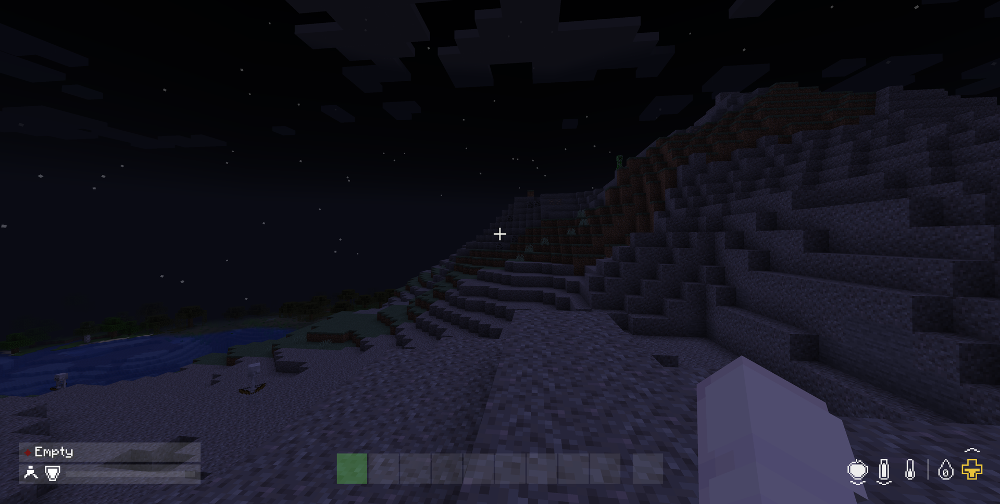
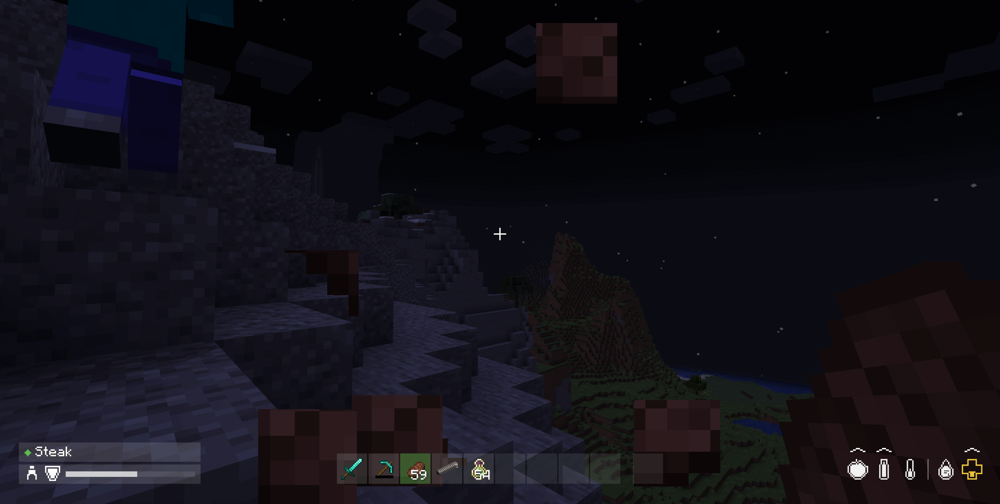
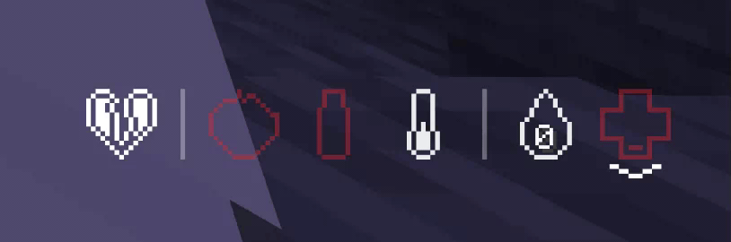
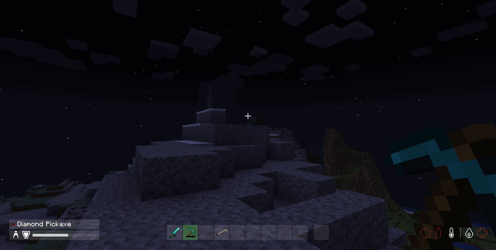
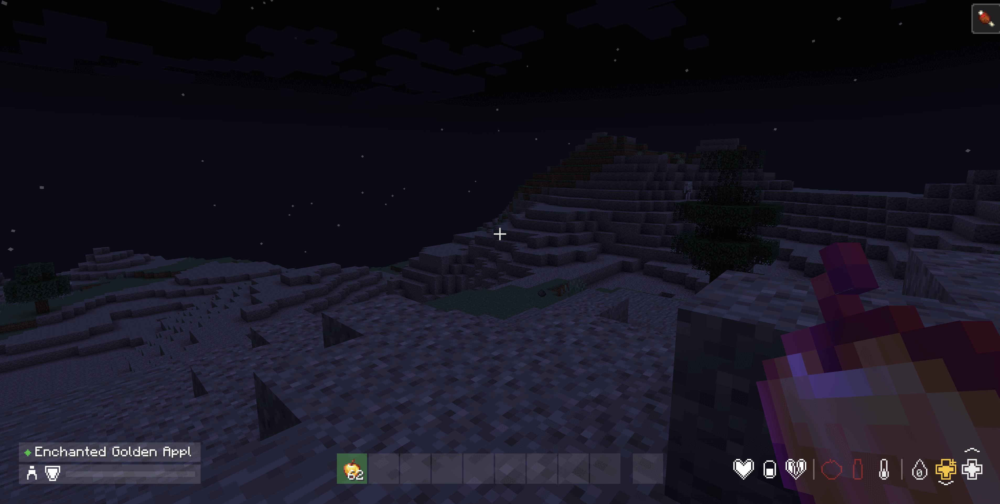

# DayZ Hotbar

[English](README.md) · [中文](README.zh.md) · [Français](README.fr.md) · **日本語** · [한국어](README.ko.md)

[](LICENSE)
[](https://modrinth.com/mod/dayz-hotbar)
[](https://www.curseforge.com/minecraft/mc-mods/dayz-hotbar)


[](https://github.com/aacanadaa/DayZ-Hotbar/issues)
[](https://ko-fi.com/suoim)

Minecraft の HUD を DayZ スタイルのホットバーと DayZ スタイルのステータス表示に置き換え、
[DayZ Inventory](https://github.com/aacanadaa/DayZ-Inventory) と見た目を揃えるように
デザインされています。

**Minecraft 1.20.1 から 26.3 まで、単一のソースツリーと 3 つのローダーで対応。すべてのローダーで
API モッドは不要です。**

## 対応バージョン

バージョンのマトリクス全体は [Stonecutter](https://stonecutter.kikugie.dev/) による条件コンパイルで
単一のソースツリーから構築され、（ローダー × ゲームバージョン）ごとに 1 つの jar を生成します。

| Minecraft | Fabric | Forge | NeoForge | Java |
| :--- | :---: | :---: | :---: | :---: |
| **1.20.1 – 1.20.4** | ✅ | — | — | 17 |
| **1.20.5** | ✅ | — | — | 21 |
| **1.20.6 – 1.21.1** | ✅ | ✅ | ✅ | 21 |
| **1.21.2** | ✅ | — | ✅ | 21 |
| **1.21.3 – 1.21.5** | ✅ | ✅ | ✅ | 21 |
| **1.21.6 – 1.21.7** | ✅ | — | ✅ | 21 |
| **1.21.8 – 1.21.11** | ✅ | ✅ | ✅ | 21 |
| **26.1 – 26.3** | ✅ | — | ✅ | 25 |

Forge には 1.21、1.21.6、1.21.7 はありません：これらの Forge 系列にはフック可能な HUD レイヤー
API がありません。Forge には 1.21.2（未公開）と 26.x もありません。詳細な判断根拠は
[docs/BUILDING.en.md](docs/BUILDING.en.md) に記録されています。

どのビルドも同じ HUD を描画しますが、jar は**互換性がありません** — ゲームバージョンとローダーに
合うものを選んでください。

> **ヒント — GUI スケール。** HUD は固定ピクセルサイズでレイアウトされており、Minecraft のデフォルトの
> *自動* GUI スケール向けに調整されています。GUI スケールが**大きい**と、ホットバー、プレイヤーパネル、
> ステータス表示が詰まって画面中央で衝突することがあります；**小さすぎる**とアイコンが読みにくく
> なります。どちらの場合も **オプション → ビデオ設定 → GUI スケール** を調整してください。




インベントリモッドと合わせた様子 ^^

---

## 機能

### ホットバー

オフハンド含め 9 スロットを 1 行の平坦な列に並べ、DayZ Inventory 画面と同じほぼ黒の半透明スタイル
です。各グレーのボックスは 22x22 でボックス間に 1 ピクセルの隙間のみ；背面板もアウトラインも一切
なく — スロットの状態は色塗りの色だけで伝えます。

| 状態 | 意味 |
| :--- | :--- |
| 暗い塗り | 空 |
| 明るい塗り | アイテムを保持中 |
| 緑の塗り | 現在手に持っているスロット |
| 赤の塗り | 手に持っているが、アイテムがクールダウン中で使用できない |

スロットの切り替えにはアニメーションがあります：新しく手に取ったスロットは**黄色**で始まり、約 3 分の
1 秒で**緑**に落ち着くので、切り替えが瞬間的な切り替えではなくイベントとして感じられます。



### ステータス表示

右下に横一列のアイコンがあり、ホットバーと同じマージンに収まるため、HUD 全体が画面上を横切る 1 本の
線として読めます。各アイコンは**容器**として描かれます — 輪郭、1 セルの空き、そして値が上がるにつれ
下から埋まる内部。輪郭は塗りと同じ色なので、黄色いアイコンは黄色い輪郭になります。

この行は左から右へ 3 つのセクションに分かれます：

| セクション | アイコン |
| :--- | :--- |
| **効果** | アクティブなポーション効果の種類ごとに 1 つのマーク |
| **補給** | 食料はリンゴで、満腹度はより明るい塗りとして上に重ねる；水はボトル；体温は温度計；空気は泡で、水中のときのみ表示 |
| **バイタル** | 経験は中にレベル数字が入ったしずく；吸収は金色の十字；生命は十字、騎乗中はマウントの生命 |

セクションの間は縦線で区切られ、両側に何かがあるときだけ描かれます — つまり効果の区切り線は効果
自体と共に現れ消え、補給とバイタルの間の線は常にあります。

吸収は専用アイコンではなく**2 つ目の十字**として描かれ、右上に小さなプラスのバッジが付きます —
プラスが両者を区別します。

現れる／消えるアイコンは常にいるアイコンを押ししません：この行は右揃えなので、左側で伸び縮みします。

> **水と体温は描いていますが、まだデータを読んでいません。** 水は食料に追従するので、食料が動くと
> 一緒に動きます。体温は半分・白色で止まっており、温度計上で「快適」を意味します。どちらも渇きと
> 体温システムのプレースホルダーで、対応するモッドが存在すれば実際の値になります。

### カラーバンド

生命と食料は **DayZ 自身のバンド**を使い、両者は異なります。生命は 100 HP 基準、食料は 5,000 ポイントの
備蓄基準で表示されます。

| | 白 | 黄 | 赤 | 点滅 |
| :--- | :--- | :--- | :--- | :--- |
| **生命** | 61–100% | 31–60% | 15–30% | 0–14% |
| **食料** | 16–100% | 6–15% | 2–5% | 0–1.9% |

Minecraft のバーはどちらも 20 ポイントなので、生命は 12 以下で黄色、6 以下で赤、3 未満で点滅；
食料は 3 以下で黄色、1 で赤、空のときのみ点滅します。食料は意図的に寛容な方です：DayZ では、
飢餓の警告は失血の警告よりはるかに遅く来ます。



臨界バンドの動き — 食料、水、生命がすべて空で赤く点滅しています。左の増益効果ハートと経験のしずくは
その間も白いままで、効果はオンかオフかしかなく、レベルの途中であることは警告ではないからです。

空気には独自のバンドがなく、生命のものを借りています — 溺死と失血は同じ種類の緊急事態だからです。
吸収と経験は意図的に**カラーティアリングしません**：吸収が少ないことは警告ではなく、レベルの途中で
あることも警告ではありません。

### トレンドマーカー

積み重ねたシェブロンが各ステータスの動き方を示します — 上昇時はアイコンの**上**、下降時は**下**に
置かれ、マーカーは値が向かう側にあります。

- **シェブロン 1 個** — 通常の変動
- **シェブロン 2 個** — 大きな変化。毒のティックや再生効果が単なる自然な空腹減少と違って読める
  のはこのためです

動きが止んだ後も 1.5 秒保持してからフェードアウト — 短いダメージのやり取りを見逃すには長めです。
閾値はステータスごとに 1 秒で測定され、動きが遅いステータスには意図的に低く設定されています：
自然回復は毎秒約 0.25 HP のみで、閾値 1.0 では決して発動せず、回復していることに気づきません。

体温には決してマーカーを表示しません。その矢印はあなたが干渉できない方向を指す上、将来の読み値は
トレンドではなくレベルです。

### プレイヤーパネル

左下隅に、ホットバーのスロットと同じ塗りの 2 行パネルがあります。

- **上の行** — 手持ちアイテム：DayZ のコンディションドット（新品、使用済み、損傷、大破、壊滅）と
  その名前。右半分は武器の発射モード、射程、弾薬のために意図的に空けてあります。
- **下の行** — 姿勢フィギュア（歩行、スプリント、蹲踞）、盾マーク、アーマーバー。



### 効果マーク

アクティブなポーション効果は効果ごとではなく**種類ごとに 1 マーク**に折りたたみます — Minecraft には
30 種類以上の効果があり、効果ごとに増える行は画面端を食いつぶすからです。一目で重要なのは、自分が
何*種類*のものに乗っているかです。

| マーク | 種類 |
| :--- | :--- |
| ハート | 有益 — 速度、力、暗視 |
| ピル | 回復 — 再生、吸収、満腹 |
| 割れたハート | 有害 — 毒、空腹、採掘疲労、その他すべての悪性 |

効果はオンかオフかしかないので、すべて白で描かれ、塗りレベルもカラーバンドもありません。効果が
終わるとそのマークは消えるのではなく 1 秒かけて**フェードアウト**します。



### 手描き、テクスチャではない

すべてのアイコンはテクスチャから読み込まず、ソース内で 15x15 グリッド上に定義されたピクセルアート
です。モッドは独自のアイコンアートを同梱しないため、リソースパックと衝突しません。

---

## インストール

Minecraft のバージョンとローダーに合う jar を選んでください。ファイル名には両方が含まれます，例：
`dayz-hotbar-fabric-1.21.1-1.2.0.jar`。どのビルドも同じ HUD を描画しますが、異なるバージョンと
ローダー向けに構築されており、**互換性がありません**。

1. ゲームバージョンに対応するローダーをインストール —
   [Fabric Loader](https://fabricmc.net/use/)、
   [Forge](https://files.minecraftforge.net/net/minecraftforge/forge/) または
   [NeoForge](https://neoforged.net/)。
2. 対応する jar を `mods` フォルダーに入れます。

ダウンロードは [releases ページ](https://github.com/aacanadaa/DayZ-Hotbar/releases)、および各ストアで
実行中のバージョンの項目から取得できます。

どのローダーも API モッドは不要です — Fabric API も不要で、Forge / NeoForge 側にも追加は不要です。
Forge と NeoForge は似て見えますが別々のダウンロードです：異なるローダーで異なる HUD API を持ち、
jar は互換性がありません。

---

## 依存関係

| | 要件 |
| :--- | :--- |
| モッドバージョン | 1.2.0（単一ソースで 1.20.1 – 26.3 をカバー） |
| Fabric | ゲームバージョンに合う Fabric Loader |
| Forge | HUD レイヤー API を提供し、ゲームバージョンに合う Forge 系列 |
| NeoForge | 1.20.6 以上 |
| Java | 1.20.5+ は 21+；1.20.1–1.20.4 は 17；26.x は 25 |
| Fabric API | 不要 |
| Forge / NeoForge API モッド | 不要 |

---

## 注意

- バニラの生命、空腹、アーマー、空気、経験の要素は上に描かず無効化するため、二重描画はありません。
- バニラ自身の可視性ルールを引き継ぎます：HUD は開いた画面の背後、観戦モード、F1 押下時では従来どおり
  隠れます。
- バニラの攻撃力インジケーターはホットバー内にあったため、ホットバーの置き換えで消えます。再実装は
  していません — 必要なら **オプション → ビデオ設定 → 攻撃インジケーター** を*照準*に設定してください。
- **Forge 1.20.6 と 1.21.1–1.21.5 では**、2 つの小さなバニラ要素も一緒に消えます：短い「選択アイテム名」
  ポップアップと、馬に乗る際のジャンプチャージバー。これらの Forge 系列はスロット行、経験バー、
  生命行、マウントの生命を 1 レイヤーにまとめており、個別に残せる細かいものはありません。
- **1.21.6 から**、バニラは経験バーをマウントのジャンプゲージとロケーターバーも収めた共有の
  「コンテキストバー」に移しました。経験バーの置き換えは Fabric、NeoForge、および（1.21.8 から）
  Forge でそのウィジェット全体を消します：DayZ 表示は独自の経験アイコンを描きますが、バニラの
  ロケーターおよびジャンプバーは再描画されません。1.20.1–1.21.5 では 3 つのローダーがそれらを
  保持します。

---

## ソースからビルド

このツリーは [Stonecutter](https://stonecutter.kikugie.dev/) でマトリクス全体を管理します：
**単一のソース**、`settings.gradle.kts` 内の 1 つのバージョンリスト、（ローダー × ゲームバージョン）
ごとに 1 つのビルドノード。ランチャー JDK として **JDK 25** が必要です — 各ゲームバージョンが
必要とする Java 17 / 21 / 25 ツールチェーンは foojay リゾルバーが必要に応じてダウンロードします。

```bash
# Build every version and loader in the matrix
JAVA_HOME=/path/to/jdk-25 ./gradlew chiseledBuild

# Build a single node
JAVA_HOME=/path/to/jdk-25 ./gradlew :fabric:1.21.1:build
JAVA_HOME=/path/to/jdk-25 ./gradlew :neoforge:26.2:build
JAVA_HOME=/path/to/jdk-25 ./gradlew :forge:1.21.11:build

# List every node
./gradlew matrix
```

成果物はノード自身のビルドディレクトリに、ファイル名にゲームバージョンを含めて出力されます：

- `fabric/versions/<mc>/build/libs/dayz-hotbar-fabric-<mc>-<version>.jar`
- `neoforge/versions/<mc>/build/libs/dayz-hotbar-neoforge-<mc>-<version>.jar`
- `forge/versions/<mc>/build/libs/dayz-hotbar-forge-<mc>-<version>.jar`

これらがすべて配布可能な成果物で、後処理ステップは不要です。同じフォルダーに `-sources.jar` も
書き出されるので、手動コピーする際は正しいファイルを選ぶようにしてください。ビルドの仕組みと
マトリクスの欠落の理由は [docs/BUILDING.en.md](docs/BUILDING.en.md) を参照してください。

---

## リンク

- **ソース**：<https://github.com/aacanadaa/DayZ-Hotbar>
- **課題**：<https://github.com/aacanadaa/DayZ-Hotbar/issues>
- **変更履歴**：[CHANGELOG.md](CHANGELOG.md)
- **DayZ Inventory**：<https://github.com/aacanadaa/DayZ-Inventory>

---

## ライセンスと著作権

[Apache License 2.0](LICENSE) の下でライセンスされています。

使用、改変、再配布（Modpack、サーバー、商用）は自由です。唯一の条件は、配布するすべてのコピーに
著作権表示とライセンスの写しが付いていることです。

Copyright 2026 suoim.
